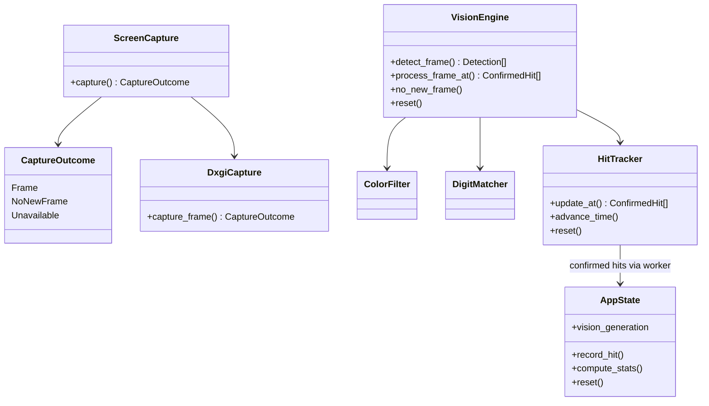

# GenshinDamageLens

A Windows damage-capture overlay built with Rust, Tauri, DXGI and vanilla JavaScript. It reads visible damage numbers from screenshots and aggregates confirmed hits into rolling DPS, totals, peak hits and elemental breakdowns.

## Running

Requires Windows 10/11, the Rust MSVC toolchain, Node.js and pnpm.

```powershell
pnpm install
pnpm run dev
# Build the desktop application:
pnpm run build
```

The overlay starts in interactive mode. Press **F8** or the mode button for click-through. The badge shows **Tracking**, **Waiting for game**, or **Paused**, based on the capture worker. Test Hit and Demo Loop generate simulated hits; use Reset before measuring real combat.

## Capture and recognition

1. Find the visible Genshin client area and select its display and graphics adapter.
2. Acquire a DXGI desktop frame, copy it through a CPU-readable staging texture and crop to the game.
3. Segment damage-colored components, choose touching-glyph cuts using template scores, and assemble number candidates.
4. Recognize digits using normalized template overlap and shape checks. Recover fragmented digits and check Physical text outlines against both dark and bright backgrounds.
5. Associate observations by position, motion, size and element. Confirm after at least three observations, 65 ms, upward motion and a confidence-weighted majority for the exact value.
6. Record a confirmed track once and publish damage and statistics events to the overlay.

An ordinary DXGI timeout ages tracks without clearing them. Missing/minimized game capture or a device error clears tracking; device failures trigger reconstruction with a one-second retry interval. Reset and pause invalidate in-flight recognition results.

This is heuristic OCR. It can miss occluded, brief, overlapping or unusually rendered numbers; confidence scores are not calibrated probabilities. Critical-hit classification is a visual size/marker heuristic. Capture uses OS desktop pixels, without game memory reads or injected hooks. No guarantee of recognition accuracy, game policy compatibility, fixed FPS, CPU or memory usage is implied.

## Architecture



| Location | Responsibility |
|---|---|
| `src-tauri/src/lib.rs` | Tauri commands, capture loop, reset/pause generation checks, event delivery |
| `src-tauri/src/capture/` | Window discovery, display selection, desktop capture and crop coordinates |
| `src-tauri/src/vision/filter.rs` | Color segmentation, outlines, glyph splitting and clustering |
| `src-tauri/src/vision/matcher.rs` | Digit templates, fragment recovery, whole-number validation |
| `src-tauri/src/vision/tracker.rs` | Motion association, value voting, expiry and deduplication |
| `src-tauri/src/vision/replay.rs` | Labeled recognition/event scoring |
| `src-tauri/src/state.rs` | Session hits, rolling DPS and aggregation |
| `src/main.js` | Overlay rendering, IPC and controls |
| `src-tauri/examples/` | Screenshot inspection and replay commands |
| `src-tauri/tests/fixtures/` | Checked-in screenshot regressions and labels |

## Validation

```powershell
cargo test --manifest-path src-tauri/Cargo.toml --offline
cargo check --manifest-path src-tauri/Cargo.toml --offline --all-targets
node --check src/main.js
cargo run --manifest-path src-tauri/Cargo.toml --offline --release --example replay -- src-tauri/tests/fixtures/recognition.json --check
cargo run --manifest-path src-tauri/Cargo.toml --offline --release --example replay -- src-tauri/tests/fixtures/electro-events.json --check
```

Remove `--offline` when dependencies have not been downloaded. Test builds optimize the pixel-processing loops. The checked-in recognition tests fail if their images are missing. Older diagnostic/video tests use optional local `sample_video/` and `scratch/` recordings and may skip when those files are absent; their results are not a complete accuracy benchmark.

See [replay evaluation](docs/recognition.md) for annotation format, metrics and the next OCR decision.

## Current limits

- DXGI captures the visible desktop: other windows can obscure game pixels.
- Selects the monitor containing the game center; a window spanning displays captures only that monitor's intersection. Negative display coordinates are supported; rotated displays are explicitly unsupported.
- A minimum 640 × 480 visible crop is required. HUD exclusion regions and size/color thresholds assume the usual game layout.
- Short capture gaps preserve tracks for up to 350 ms. Hits observed fewer than three times are intentionally left unconfirmed.
- Neural OCR and Windows Graphics Capture are evaluation candidates, not active backends. Keep a recognizer replacement behind the same labeled replay contract and require measured improvements on held-out recordings before switching.
